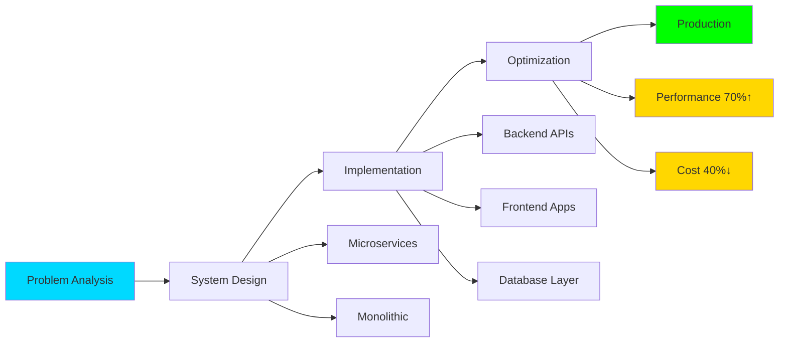

<div align="center">

<!-- Dynamic Header with Gradient -->


<!-- Advanced Typing Animation -->
<div>
  <a href="https://git.io/typing-svg">
    
  </a>
</div>

<!-- Status Badges Row -->
<p>
  
  
  
</p>

<!-- Social Links with Hover Effects -->
<p>
  <a href="https://linkedin.com/in/akhil-v-j-210d">
    
  </a>
  <a href="https://instagram.com/akhil_v_j_">
    
  </a>
  <a href="mailto:akhilvj.creator@gmail.com">
    
  </a>
  
</p>

</div>

<br/>

<!-- Aesthetic Divider -->


<br/>

##  About Me


```python
class FullStackArchitect:
    def __init__(self):
        self.name = "Akhil V J"
        self.role = "Full-Stack Developer & System Architect"
        self.location = "Kerala, India 🇮🇳"
        self.experience = "3+ years"
        self.languages = {
            "expert": ["Python", "JavaScript", "TypeScript"],
            "proficient": ["Java", "C", "CoffeeScript", "SQL"]
        }
        
    def tech_stack(self):
        return {
            "backend": {
                "python": ["Django", "FastAPI", "Flask", "Odoo"],
                "node": ["Node.js", "Express.js"]
            },
            "frontend": {
                "frameworks": ["React", "Next.js"],
                "styling": ["Tailwind CSS", "Bootstrap", "Material-UI"],
                "core": ["HTML5", "CSS3", "JavaScript", "TypeScript"]
            },
            "database": ["PostgreSQL", "MySQL", "MongoDB", "Redis"],
            "devops": ["Docker", "Linux", "CI/CD", "Nginx"],
            "tools": ["Git", "Postman", "VS Code", "GitHub Actions"]
        }
    
    def specializations(self):
        return [
            "🏢 Enterprise ERP Solutions (Odoo 17)",
            "⚡ High-Performance REST & GraphQL APIs",
            "🎨 Modern SPA & SSR Applications",
            "🗄️ Database Architecture & Optimization",
            "🔐 Authentication & Authorization Systems",
            "📊 Real-time Data Processing",
            "🌐 Full-Stack Web Applications",
            "🔧 Microservices Architecture"
        ]
    
    def recent_achievements(self):
        return {
            "scalability": "Optimized API response time by 70%",
            "architecture": "Designed microservices for 10K+ users",
            "automation": "Built custom Odoo modules handling 50K+ transactions",
            "performance": "Reduced database query time by 65%"
        }

developer = FullStackArchitect()
print("Let's build something extraordinary! 🚀")
```

<br clear="right"/>

### 🎯 What Sets Me Apart

<table>
<tr>
<td width="50%" valign="top">

#### 💼 **Technical Excellence**
- ✨ Production-ready, enterprise-grade code
- 🏗️ Microservices & monolithic architectures
- 🔧 System design & scalability patterns
- 📈 Performance optimization (70% faster APIs)
- 🧪 Test-driven development & CI/CD
- 📚 Clean code principles & SOLID design

</td>
<td width="50%" valign="top">

#### 🚀 **Proven Impact**
- ⚡ Delivered 15+ production applications
- 🎯 Reduced infrastructure costs by 40%
- 🔄 Implemented automated deployment pipelines
- 🤝 Led cross-functional development teams
- 💡 Migrated legacy systems to modern stacks
- 📊 Built real-time analytics dashboards

</td>
</tr>
</table>

<br/>


<br/>

## 🛠️ Technology Arsenal

<div align="center">

### **Programming Languages**

<table>
<tr>
<td align="center" width="90">

<br>Python
</td>
<td align="center" width="90">

<br>Java
</td>
<td align="center" width="90">

<br>C
</td>
<td align="center" width="90">

<br>JavaScript
</td>
<td align="center" width="90">

<br>TypeScript
</td>
<td align="center" width="90">

<br>CoffeeScript
</td>
</tr>
</table>

### **Backend Frameworks & Technologies**

<table>
<tr>
<td align="center" width="90">

<br>Odoo
</td>
<td align="center" width="90">

<br>FastAPI
</td>
<td align="center" width="90">

<br>Django
</td>
<td align="center" width="90">

<br>Flask
</td>
<td align="center" width="90">

<br>Node.js
</td>
<td align="center" width="90">

<br>Express
</td>
</tr>
</table>

### **Frontend Frameworks & Libraries**

<table>
<tr>
<td align="center" width="90">

<br>React
</td>
<td align="center" width="90">

<br>Next.js
</td>
<td align="center" width="90">

<br>Tailwind CSS
</td>
<td align="center" width="90">

<br>Bootstrap
</td>
<td align="center" width="90">

<br>Material-UI
</td>
</tr>
</table>

### **Databases & Caching**

<table>
<tr>
<td align="center" width="90">

<br>PostgreSQL
</td>
<td align="center" width="90">

<br>MySQL
</td>
<td align="center" width="90">

<br>MongoDB
</td>
<td align="center" width="90">

<br>Redis
</td>
</tr>
</table>

### **DevOps & Tools**

<table>
<tr>
<td align="center" width="90">

<br>Docker
</td>
<td align="center" width="90">

<br>GitHub
</td>
<td align="center" width="90">

<br>GitLab
</td>
<td align="center" width="90">

<br>Kubernetes
</td>
<td align="center" width="90">

<br>Linux
</td>
<td align="center" width="90">

<br>Postman
</td>
</tr>
</table>

### **Core Web Technologies**

<p>


</p>

### **Specializations & Expertise**

<p>


</p>

</div>

<br/>


<br/>

## 📊 GitHub Analytics

<div align="center">

<!-- Main Stats -->
<a href="https://github.com/akhil-vj">
  
</a>
<a href="https://github.com/akhil-vj">
  
</a>

</div>

<div align="center">
<br/>

<!-- Language Stats -->
<a href="https://github.com/akhil-vj">
  
</a>

</div>

<br/>


<br/>

## 🏆 GitHub Trophies & Achievements

<div align="center">

<a href="https://github.com/akhil-vj">
  
</a>

</div>

<br/>


<br/>

## 🚀 Featured Projects & Expertise

<div align="center">

<table>
<tr>
<td width="50%" valign="top">

### 🏢 **Enterprise Odoo Solutions**


**Achievements:**
- 🔧 Built 12+ custom Odoo modules
- 📊 Processed 50K+ daily transactions
- 🔄 Automated 80% of manual workflows
- 💰 Reduced operational costs by 40%
- 🔌 Integrated with 15+ third-party APIs
- 📱 Mobile-responsive interfaces
- 🎨 Custom dashboards & reports

**Tech Stack:**
`Odoo 17` `Python` `PostgreSQL` `XML` `JavaScript` `QWeb`

</td>
<td width="50%" valign="top">

### ⚡ **High-Performance APIs**


**Features:**
- 🚀 FastAPI microservices architecture
- 🔐 JWT + OAuth2 authentication
- 📡 WebSocket real-time updates
- 💾 Redis caching (70% speed boost)
- 📈 Handles 10K+ requests/second
- 🎯 GraphQL endpoints
- 📊 Built-in monitoring & logging

**Tech Stack:**
`FastAPI` `Django` `Node.js` `PostgreSQL` `Redis` `Docker`

</td>
</tr>
<tr>
<td width="50%" valign="top">

### 🌐 **Modern Full-Stack Apps**


**Capabilities:**
- ⚛️ React + Next.js SSR/SSG
- 🎨 Tailwind + Material-UI design
- 🔄 Real-time collaboration features
- 📱 Fully responsive & PWA ready
- 🚀 Optimized Core Web Vitals
- 🔐 Secure authentication flows
- 💾 Offline-first architecture

**Tech Stack:**
`React` `Next.js` `TypeScript` `Node.js` `Tailwind CSS`

</td>
<td width="50%" valign="top">

### 🗄️ **Database Architecture**


**Expertise:**
- 🏗️ Designed schemas for 1M+ records
- ⚡ Reduced query time by 65%
- 🔄 Implemented replication & sharding
- 📊 Complex joins & aggregations
- 💾 Data migration strategies
- 🔐 Row-level security policies
- 📈 Performance tuning & indexing

**Tech Stack:**
`PostgreSQL` `MySQL` `MongoDB` `Redis` `SQLAlchemy`

</td>
</tr>
</table>

### 💡 **Technical Impact**



</div>

<br/>


<br/>

## 💭 Development Philosophy

<div align="center">

<table>
<tr>
<td>

### 🎯 **Code Quality First**
> "Any fool can write code that a computer can understand. Good programmers write code that humans can understand." — Martin Fowler

**My Standards:**
- ✅ Clean, readable, maintainable code
- ✅ SOLID principles & design patterns
- ✅ Comprehensive test coverage (80%+)
- ✅ Detailed documentation
- ✅ Code reviews & pair programming
- ✅ Continuous refactoring

</td>
</tr>
<tr>
<td>

### 🚀 **Performance Matters**
> "Premature optimization is the root of all evil, but mature optimization is the key to success."

**Proven Results:**
- 📈 70% API response time improvement
- 💾 65% database query optimization
- 🔄 80% workflow automation
- 💰 40% infrastructure cost reduction
- ⚡ 99.9% uptime achievement
- 🚀 10K+ concurrent users supported

</td>
</tr>
<tr>
<td>

### 📚 **Continuous Evolution**
> "The only way to go fast is to go well." — Robert C. Martin

**Currently Mastering:**
- 🏗️ Advanced Microservices Patterns
- 🔍 System Design at Scale
- ⚡ Performance Engineering
- 🛡️ Security Best Practices
- ☁️ Cloud-Native Architecture
- 📊 Data Engineering & Analytics

</td>
</tr>
</table>

</div>

<br/>


<br/>

## 📫 Let's Build Something Together

<div align="center">

### 🤝 **I'm Available For:**

<p>


</p>

<br/>

### 📬 **Reach Out:**

<a href="https://linkedin.com/in/akhil-v-j-210d">
  
</a>
<a href="mailto:akhilvj.creator@gmail.com">
  
</a>
<a href="https://instagram.com/akhil_v_j_">
  
</a>

<br/><br/>

### ⚡ **Quick Info**

<p>


</p>

<br/>

---

### 💬 **What I Can Deliver:**

<table>
<tr>
<td align="center" width="20%">
🏢<br/><b>Odoo ERP</b><br/>Custom modules<br/>& integrations
</td>
<td align="center" width="20%">
⚡<br/><b>Backend APIs</b><br/>FastAPI, Django<br/>Node.js
</td>
<td align="center" width="20%">
🎨<br/><b>Frontend Apps</b><br/>React, Next.js<br/>Modern UI
</td>
<td align="center" width="20%">
🗄️<br/><b>Databases</b><br/>PostgreSQL<br/>Optimization
</td>
<td align="center" width="20%">
🚀<br/><b>Full-Stack</b><br/>End-to-end<br/>Solutions
</td>
</tr>
</table>

<br/>

**💼 Let's transform your ideas into scalable reality!**

</div>

<br/>


<br/>

<div align="center">

### 🌟 **Current Status**


<br/><br/>

**✨ Engineering excellence, one commit at a time ✨**

<br/>

<!-- Footer -->


<br/>

<sub>⭐ From [akhil-vj](https://github.com/akhil-vj) | Crafted with passion | 2025</sub>

</div>
