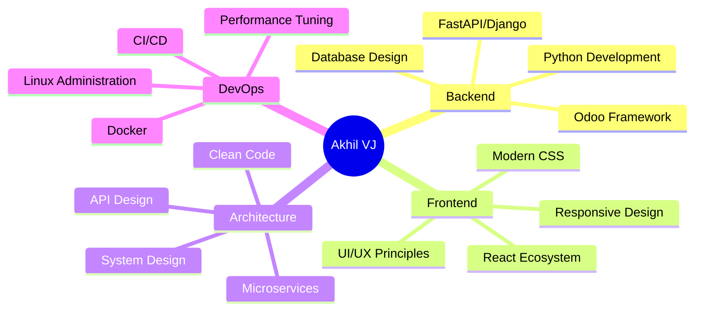

<div align="center">

<!-- Dynamic Header with Gradient -->


<!-- Advanced Typing Animation -->
<div>
  <a href="https://git.io/typing-svg">
    
  </a>
</div>

<!-- Status Badges Row -->
<p>
  
  
  
</p>

<!-- Social Links with Hover Effects -->
<p>
  <a href="https://linkedin.com/in/akhil-v-j-210d">
    
  </a>
  <a href="https://instagram.com/akhil_v_j_">
    
  </a>
  <a href="mailto:akhilvj.creator@gmail.com">
    
  </a>
  
</p>

</div>

<br/>

<!-- Aesthetic Divider -->


<br/>

##  About Me


```python
class SoftwareArchitect:
    def __init__(self):
        self.name = "Akhil V J"
        self.role = "Full-Stack Python Developer"
        self.location = "Kerala, India 🇮🇳"
        self.languages = ["Python", "JavaScript", "SQL"]
        
    def current_focus(self):
        return {
            "backend": ["FastAPI", "Odoo 17", "Django"],
            "frontend": ["React", "Tailwind CSS", "Modern UI/UX"],
            "database": ["PostgreSQL", "Query Optimization"],
            "devops": ["Docker", "CI/CD", "Linux"],
            "architecture": ["Microservices", "Clean Code", "SOLID"]
        }
    
    def expertise_areas(self):
        return [
            "🏢 Enterprise Odoo Solutions",
            "⚡ High-Performance APIs",
            "🎨 Modern Web Applications",
            "🗄️ Database Architecture",
            "🔐 Authentication Systems",
            "📊 Data Processing & Analytics"
        ]
    
    def philosophy(self):
        return "Write code that speaks for itself, " \
               "build systems that scale, " \
               "and create solutions that matter."

developer = SoftwareArchitect()
print(developer.philosophy())
```

<br clear="right"/>

### 🎯 What Sets Me Apart

<table>
<tr>
<td width="50%" valign="top">

#### 💼 **Technical Excellence**
- ✨ Production-ready, enterprise-grade code
- 🔧 Deep understanding of system architecture
- 📈 Performance optimization & scalability
- 🧪 Test-driven development practices
- 📚 Clean code & design patterns

</td>
<td width="50%" valign="top">

#### 🚀 **Delivery Focus**
- ⚡ Fast turnaround without compromising quality
- 🎯 Clear communication & documentation
- 🔄 Agile & iterative development
- 🤝 Collaborative problem-solving
- 💡 Innovative & practical solutions

</td>
</tr>
</table>

<br/>


<br/>

## 🛠️ Technology Stack

<div align="center">

### **Core Technologies**

<table>
<tr>
<td align="center" width="96">

<br>Python
</td>
<td align="center" width="96">

<br>FastAPI
</td>
<td align="center" width="96">

<br>React
</td>
<td align="center" width="96">

<br>PostgreSQL
</td>
<td align="center" width="96">

<br>Docker
</td>
<td align="center" width="96">

<br>Git
</td>
</tr>
</table>

### **Frontend Development**

<table>
<tr>
<td align="center" width="96">

<br>JavaScript
</td>
<td align="center" width="96">

<br>HTML5
</td>
<td align="center" width="96">

<br>CSS3
</td>
<td align="center" width="96">

<br>Tailwind
</td>
<td align="center" width="96">

<br>Bootstrap
</td>
</tr>
</table>

### **Tools & Platforms**

<table>
<tr>
<td align="center" width="96">

<br>VS Code
</td>
<td align="center" width="96">

<br>Postman
</td>
<td align="center" width="96">

<br>Linux
</td>
<td align="center" width="96">

<br>GitHub
</td>
<td align="center" width="96">

<br>GitLab
</td>
</tr>
</table>

### **Specializations**

<p>


</p>

</div>

<br/>


<br/>

## 📊 GitHub Analytics

<div align="center">


</div>

<div align="center">
<br/>


</div>

<div align="center">
<br/>

<!-- Contribution Graph -->


</div>

<br/>


<br/>

## 🏆 GitHub Trophies

<div align="center">


</div>

<br/>


<br/>

## 🚀 Featured Projects & Expertise

<div align="center">

<table>
<tr>
<td width="50%" valign="top">

### 🏢 **Odoo Enterprise Solutions**


**Capabilities:**
- 🔧 Custom module development
- 🔄 Complex workflow automation
- 📊 Advanced reporting & analytics
- 🔌 Third-party API integrations
- 👥 Multi-company architectures
- 📱 Mobile-responsive interfaces
- 🎨 Custom UI/UX implementations

**Tech Stack:**
`Python` `XML` `PostgreSQL` `JavaScript` `QWeb`

</td>
<td width="50%" valign="top">

### ⚡ **FastAPI + React Ecosystems**


**Features:**
- 🔐 JWT-based authentication
- 📡 Real-time data processing
- 🎯 RESTful API design
- 🚀 Async/await patterns
- 💾 Redis caching layers
- 📈 Performance monitoring
- 🎨 Modern responsive UI

**Tech Stack:**
`FastAPI` `React` `PostgreSQL` `Docker` `Redis`

</td>
</tr>
</table>

### 💡 **Core Competencies**



</div>

<br/>


<br/>

## 🎨 Contribution Activity

<div align="center">

<picture>
  <source media="(prefers-color-scheme: dark)" srcset="https://raw.githubusercontent.com/akhil-vj/akhil-vj/output/github-contribution-grid-snake-dark.svg">
  <source media="(prefers-color-scheme: light)" srcset="https://raw.githubusercontent.com/akhil-vj/akhil-vj/output/github-contribution-grid-snake.svg">
  
</picture>

</div>

<br/>


<br/>

## 💭 Development Philosophy

<div align="center">

<table>
<tr>
<td>

### 🎯 **Code Quality**
> "Any fool can write code that a computer can understand. Good programmers write code that humans can understand." — Martin Fowler

**Principles I Follow:**
- ✅ Clean, readable, maintainable code
- ✅ SOLID principles & design patterns
- ✅ Comprehensive documentation
- ✅ Test-driven development
- ✅ Continuous refactoring

</td>
</tr>
<tr>
<td>

### 🚀 **Problem Solving**
> "The best way to predict the future is to implement it." — David Heinemeier Hansson

**My Approach:**
- 🎯 Understand the problem deeply first
- 📊 Research & analyze multiple solutions
- 🏗️ Design scalable architectures
- ⚡ Implement efficiently
- 🔄 Iterate based on feedback

</td>
</tr>
<tr>
<td>

### 📚 **Continuous Learning**
> "The only way to go fast is to go well." — Robert C. Martin

**Currently Exploring:**
- 🔍 Advanced System Design Patterns
- 🚀 Performance Optimization Techniques
- 🏗️ Microservices Architecture
- 📊 Advanced PostgreSQL Features
- 🛡️ Security Best Practices

</td>
</tr>
</table>

</div>

<br/>


<br/>

## 📫 Let's Build Something Together

<div align="center">

### 🤝 **I'm Available For:**

<p>


</p>

<br/>

### 📬 **Reach Out:**

<a href="https://linkedin.com/in/akhil-v-j-210d">
  
</a>
<a href="mailto:akhilvj.creator@gmail.com">
  
</a>
<a href="https://instagram.com/akhil_v_j_">
  
</a>

<br/><br/>

### ⚡ **Quick Stats**

<p>


</p>

<br/>

---

### 💬 **What I Can Help With:**

<table>
<tr>
<td align="center" width="25%">
🏢<br/><b>Odoo Development</b><br/>Custom modules & integrations
</td>
<td align="center" width="25%">
⚡<br/><b>API Development</b><br/>FastAPI & RESTful services
</td>
<td align="center" width="25%">
🎨<br/><b>Full-Stack Apps</b><br/>React + Python solutions
</td>
<td align="center" width="25%">
🗄️<br/><b>Database Design</b><br/>PostgreSQL optimization
</td>
</tr>
</table>

<br/>

**💼 Let's create something remarkable together!**

</div>

<br/>


<br/>

<div align="center">

### 🌟 **Current Status**


<br/><br/>

**✨ Crafting elegant solutions to complex problems, one commit at a time ✨**

<br/>

<!-- Footer -->


<br/>

<sub>⭐ From [akhil-vj](https://github.com/akhil-vj) | Last updated: 2025</sub>

</div>
